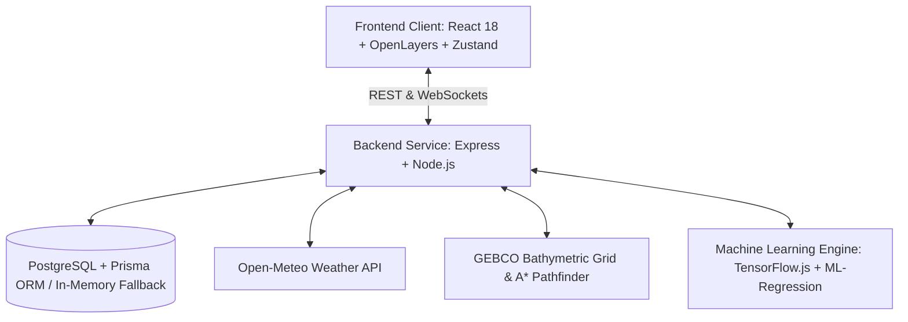

# Arctic Ship Navigation & Route Optimization System (AROS)
## Comprehensive Technical Documentation & Team Architecture Guide

---

## 1. Executive Summary

The **Arctic Ship Navigation & Route Optimization System (AROS)** is an enterprise-grade maritime navigation and decision-support platform engineered specifically for the extreme conditions of polar navigation. 

Operating in the Arctic and Antarctic waters presents severe challenges that standard commercial routing algorithms cannot address:
- **Dynamic Sea Ice & Icebergs**: Drifting pack ice, multi-year ice ridges, and sub-surface iceberg masses.
- **Extreme Weather Fluctuations**: Gale-force polar winds, freezing fog, blinding blizzards, and rapid temperature plummets.
- **Shallow Bathymetry & Polar Bottlenecks**: Permafrost continental shelves, narrow archipelagic straits (e.g., Vilkitsky, Kara Gate, Bering Strait) requiring strict vessel draft clearances.
- **Fuel Economics vs. Safety**: Balancing transit time, fuel consumption, carbon emissions, and strict Polar Code safety constraints.

AROS addresses these challenges through a hybrid architecture combining **GEBCO bathymetric depth modeling**, **A\* heuristic water-only pathfinding**, **real-time Open-Meteo weather sampling**, **dynamic risk scoring**, and **machine learning fuel modeling**.



---

## 2. System Architecture

The project is structured as a decoupled full-stack TypeScript application with real-time bidirectional communication.

```
Arctic-Ship-Navigation/
├── backend/                             # Express & TypeScript Backend Server
│   ├── prisma/                          # Database schema & migrations
│   │   ├── schema.prisma                # Models: Port, Ship, Iceberg, Route, etc.
│   │   └── seed.ts                      # Polar ports & initial navigational data
│   ├── src/
│   │   ├── config/                      # Database & environment configurations
│   │   ├── middleware/                  # Error handling & validation
│   │   ├── providers/                   # External weather & routing provider wrappers
│   │   ├── routing/                     # GEBCO Bathymetry, A* algorithm, Alternative routes
│   │   │   ├── bathymetricGrid.ts       # Ocean depth models & water/land classification
│   │   │   ├── aStarPathfinder.ts       # Heuristic graph search for navigable waters
│   │   │   ├── alternativeRoutes.ts     # Diversified corridor routing with penalties
│   │   │   └── gebcoMarineRoutingProvider.ts # Concrete implementation of RoutingProvider
│   │   ├── services/                    # Business logic (Route, Weather, Ice, Telemetry)
│   │   ├── websocket/                   # Real-time Socket.IO event broadcaster
│   │   ├── app.ts                       # Express application configuration
│   │   └── server.ts                    # HTTP server startup & database lifecycle
│   └── tsconfig.json
│
├── src/                                 # Vite + React Frontend Application
│   ├── components/                      # Modular UI components (Navbar, RiskBadge, FeatureCard)
│   ├── pages/
│   │   ├── HomePage.tsx                 # Landing page & feature showcase
│   │   └── DashboardPage.tsx            # Mission Control: Map, Route selection, Telemetry
│   ├── services/                        # Axios API client & Socket.IO consumer
│   ├── store/                           # Zustand state management
│   ├── theme/                           # Arctic dark/light maritime theme provider
│   ├── types/                           # TypeScript interfaces & domain models
│   ├── utils/                           # Polar coordinate projections, generators, ML models
│   └── index.css                        # Modern CSS styling & Tailwind directives
│
├── README.md                            # Quickstart & Repository Overview
├── PROJECT_DOCUMENTATION.md             # Complete Engineering Documentation (This File)
└── PRESENTATION.md                      # Slide Deck & Speaker Presentation Guide
```

---

## 3. Core Modules & Engineering Deep Dive

### 3.1 GEBCO Bathymetric Grid & Water-Only Navigation
Standard routing algorithms frequently plot paths over land or through dangerously shallow channels. AROS integrates a mathematical model derived from the **General Bathymetric Chart of the Oceans (GEBCO)**:

- **Grid Resolution**: Configurable cell resolution (default `0.1°`, ~11km at equator).
- **Depth Modeling**:
  - Arctic continental shelves: `50m – 200m`
  - Barents Sea: `200m – 400m`
  - Norwegian Sea & Fram Strait: `1,000m – 2,000m`
  - Arctic Abyssal Plains: `3,000m – 4,000m`
- **Navigability Classification**:
  A cell is marked navigable *if and only if*:
  $$\text{Depth} \ge \text{Vessel Draft} + \text{Safety Depth Margin}$$
  Land coordinates and sub-draft shallows are marked impassable ($Cost = \infty$).

### 3.2 A\* Marine Pathfinding Algorithm
The pathfinder operates on an 8-directional spatial grid across polar water coordinates:
- **Cost Function**:
  $$f(n) = g(n) + h(n)$$
  Where $g(n)$ is the accumulated cost from origin to node $n$, and $h(n)$ is the Great-Circle (Haversine) distance heuristic to destination.
- **Penalties**:
  - Deep Water ($\ge 100\text{m}$): Base multiplier $1.0\times$
  - Moderate Shallows: $2.0\times$ penalty
  - Shallow Waters: $5.0\times$ penalty
  - Land / Blocked Shallows: Unreachable
- **Path Simplification**: Removes collinear intermediate waypoints within a $0.5\text{km}$ tolerance to minimize payload size while preserving maritime precision.

### 3.3 Dynamic Alternative Routes
Rather than presenting a single path, AROS generates three diversified strategies:
1. **Optimal (Shortest Navigable Water Route)**: Balances path distance and water safety.
2. **Safest Route**: Applies a $3.0\times$ cost penalty corridor within a 3-cell radius around primary route to force path exploration into deeper, low-risk waters.
3. **Northern Sea Passage**: Expands search radius northward away from congested coastal choke points.
- **Overlap Filtering**: Rejects alternatives with $>50\%$ trajectory overlap to ensure genuinely distinct navigational options.

### 3.4 Live Environmental Sampling (Open-Meteo Integration)
Unlike simplistic models that query weather solely at departure and arrival:
- AROS samples live meteorological data at intervals along the **entire route geometry**.
- Parameters collected:
  - Surface Wind Speed & Gusts ($\text{km/h}$)
  - Ambient Air Temperature ($^\circ\text{C}$) & Wind Chill
  - Wave Height & Swell Period ($\text{m}$)
  - Atmospheric Pressure ($\text{hPa}$) & Visibility ($\text{km}$)
- Environmental observations are cached and persisted via Prisma for historical trend analysis.

### 3.5 Real-Time Telemetry & WebSockets
- Socket.IO server pushes continuous updates to active clients:
  - Ship position movements
  - Dynamic iceberg drift vectors
  - Port congestion metrics
  - Immediate adverse weather alerts

---

## 4. Frontend & User Interface Experience

The frontend is built for clarity in high-stress maritime navigation environments:
- **Interactive Polar Map**: Built on **OpenLayers**, supporting specialized polar stereographic projections, dynamic vector layers, waypoint dragging, and heatmaps.
- **Risk Assessment Badges**: Visual risk indicators (Low, Moderate, High, Severe) based on composite environmental indices.
- **State Management**: **Zustand** store providing instant reactivity without unnecessary React re-renders.
- **Analytics & Telemetry Charts**: Built with **Recharts**, displaying fuel consumption curves, speed profiles, and weather trends along transit timelines.

---

## 5. REST API & WebSocket Specifications

### 5.1 REST Endpoints

| Method | Endpoint | Description | Response Codes |
| :--- | :--- | :--- | :--- |
| `GET` | `/api/health` | System health check & operation mode | `200 OK` |
| `GET` | `/api/ports` | List all Arctic and Antarctic ports with congestion metrics | `200 OK` |
| `GET` | `/api/weather` | Live weather observation for specific `latitude` & `longitude` | `200 OK`, `503 Unavailable` |
| `POST` | `/api/routes/generate` | Generate optimal and alternative marine routes | `200 OK`, `400 Bad Request`, `503 Unavailable` |
| `GET` | `/api/routes/:id/monitoring` | Real-time weather and risk refresh along active route | `200 OK`, `404 Not Found` |
| `GET` | `/api/routing/status` | Current status of the GEBCO routing provider | `200 OK` |

#### Sample Route Generation Request:
```json
POST /api/routes/generate
Content-Type: application/json

{
  "departureId": "p1",
  "arrivalId": "p3"
}
```

#### Sample Response:
```json
{
  "status": "SUCCESS",
  "routes": [
    {
      "id": "route_gebco_primary_1727022000000",
      "strategy": "shortest",
      "label": "Shortest Navigable Route",
      "distanceKm": 1058.4,
      "estimatedHours": 47.6,
      "fuelTons": 68.5,
      "riskScore": 28,
      "riskLevel": "LOW",
      "coordinates": [
        [33.0827, 68.9585],
        [30.5120, 71.2210],
        [15.6267, 78.2232]
      ]
    }
  ]
}
```

---

## 6. Machine Learning & Predictive Modeling

AROS integrates client and server-side machine learning capabilities:
1. **TensorFlow.js (@tensorflow/tfjs)**: Deep learning model inference for non-linear fuel consumption estimates based on sea state, hull resistance, vessel class (Arc4, Arc7), and headwinds.
2. **Random Forest Regression (ml-random-forest)**: Multi-variate risk regression modeling historical incidents vs. sea ice concentration.
3. **K-Means Clustering (ml-kmeans)**: Spatial clustering of reported icebergs and maritime traffic hazards into hot-zones.

---

## 7. Setup, Local Execution & Development

### Prerequisites
- **Node.js**: v18.0.0 or higher
- **npm**: v9.0.0 or higher
- **Git**
- *(Optional)* **PostgreSQL** (if running full database persistence; otherwise fallback in-memory mode activates automatically)

### Step-by-Step Installation

```bash
# 1. Clone the repository
git clone https://github.com/harshalpatil63/Arctic-Ship-Navigation-.git
cd Arctic-Ship-Navigation-

# 2. Setup and run Backend
cd backend
npm install
npm run dev

# 3. In a second terminal, setup and run Frontend
cd ..
npm install
npm run dev
```

### URLs
- **Frontend Application**: [http://localhost:5173](http://localhost:5173)
- **Backend API**: [http://localhost:4000](http://localhost:4000)
- **API Health Check**: [http://localhost:4000/api/health](http://localhost:4000/api/health)

---

## 8. Technology Stack Summary

| Layer | Technology |
| :--- | :--- |
| **Frontend Framework** | React 18, Vite |
| **State Management** | Zustand |
| **Mapping Engine** | OpenLayers (`ol`), TopoJSON Client, World-Atlas |
| **Styling & Icons** | Tailwind CSS, Lucide React |
| **Data Visualization** | Recharts |
| **Machine Learning** | TensorFlow.js, ML-Matrix, ML-Regression, ML-Random-Forest, ML-KMeans |
| **Backend Runtime** | Node.js, Express |
| **TypeScript Execution**| TSX |
| **Database & ORM** | PostgreSQL, Prisma ORM |
| **Real-time Protocol** | Socket.IO (WebSockets) |
| **Spatial Analysis** | Turf.js (`@turf/boolean-point-in-polygon`, `@turf/helpers`) |
| **External APIs** | Open-Meteo Weather API |
